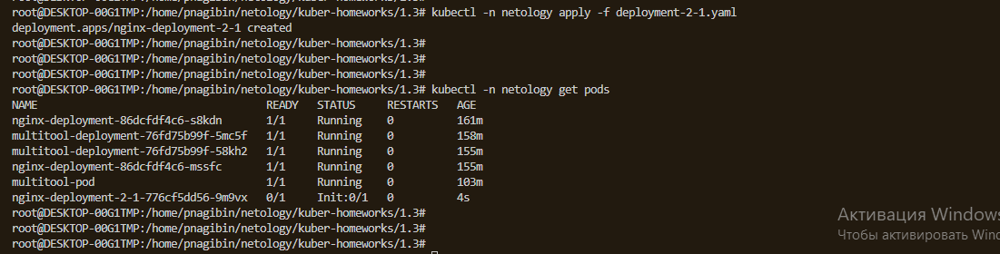

# Домашнее задание к занятию «Запуск приложений в K8S»

### Цель задания

В тестовой среде для работы с Kubernetes, установленной в предыдущем ДЗ, необходимо развернуть Deployment с приложением, состоящим из нескольких контейнеров, и масштабировать его.

------

### Чеклист готовности к домашнему заданию

1. Установленное k8s-решение (например, MicroK8S).
2. Установленный локальный kubectl.
3. Редактор YAML-файлов с подключённым git-репозиторием.

------

### Инструменты и дополнительные материалы, которые пригодятся для выполнения задания

1. [Описание](https://kubernetes.io/docs/concepts/workloads/controllers/deployment/) Deployment и примеры манифестов.
2. [Описание](https://kubernetes.io/docs/concepts/workloads/pods/init-containers/) Init-контейнеров.
3. [Описание](https://github.com/wbitt/Network-MultiTool) Multitool.

------

### Задание 1. Создать Deployment и обеспечить доступ к репликам приложения из другого Pod

1. Создать Deployment приложения, состоящего из двух контейнеров — nginx и multitool. Решить возникшую ошибку.

```
apiVersion: apps/v1
kind: Deployment
metadata:
  name: nginx-deployment
spec:
  selector:
    matchLabels:
      app: nginx
  replicas: 1 # tells deployment to run 2 pods matching the template
  template:
    metadata:
      labels:
        app: nginx
    spec:
      containers:
      - name: nginx
        image: nginx:1.14.2
        ports:
        - containerPort: 80
---
apiVersion: apps/v1
kind: Deployment
metadata:
  name: multitool-deployment
spec:
  selector:
    matchLabels:
      app: multitool
  replicas: 1 # tells deployment to run 2 pods matching the template
  template:
    metadata:
      labels:
        app: multitool
    spec:
      containers:
      - name: multitool
        image: praqma/network-multitool
        ports:
        - containerPort: 80
```

2. После запуска увеличить количество реплик работающего приложения до 2.

```
apiVersion: apps/v1
kind: Deployment
metadata:
  name: nginx-deployment
spec:
  selector:
    matchLabels:
      app: nginx
  replicas: 2 # tells deployment to run 2 pods matching the template
  template:
    metadata:
      labels:
        app: nginx
    spec:
      containers:
      - name: nginx
        image: nginx:1.14.2
        ports:
        - containerPort: 80
---
apiVersion: apps/v1
kind: Deployment
metadata:
  name: multitool-deployment
spec:
  selector:
    matchLabels:
      app: multitool
  replicas: 2 # tells deployment to run 2 pods matching the template
  template:
    metadata:
      labels:
        app: multitool
    spec:
      containers:
      - name: multitool
        image: praqma/network-multitool
        ports:
        - containerPort: 80
```

3. Продемонстрировать количество подов до и после масштабирования.

До

После


4. Создать Service, который обеспечит доступ до реплик приложений из п.1.

```
apiVersion: apps/v1
kind: Deployment
metadata:
  name: nginx-deployment
spec:
  selector:
    matchLabels:
      app: nginx
  replicas: 2 # tells deployment to run 2 pods matching the template
  template:
    metadata:
      labels:
        app: nginx
    spec:
      containers:
      - name: nginx
        image: nginx:1.14.2
        ports:
        - containerPort: 80
---
apiVersion: apps/v1
kind: Deployment
metadata:
  name: multitool-deployment
spec:
  selector:
    matchLabels:
      app: multitool
  replicas: 2 # tells deployment to run 2 pods matching the template
  template:
    metadata:
      labels:
        app: multitool
    spec:
      containers:
      - name: multitool
        image: praqma/network-multitool
        ports:
        - containerPort: 80
---
apiVersion: v1
kind: Service
metadata:
  name: nginx-svc
spec:
  ports:
  - name: http
    port: 8081
    targetPort: 80
    protocol: TCP
  selector:
    app: nginx
---
apiVersion: v1
kind: Service
metadata:
  name: multitool-svc
spec:
  ports:
  - name: http
    port: 8082
    targetPort: 80
    protocol: TCP
  selector:
    app: multitool
```


5. Создать отдельный Pod с приложением multitool и убедиться с помощью `curl`, что из пода есть доступ до приложений из п.1.

```
apiVersion: v1
kind: Pod
metadata:
  name: multitool-pod
  labels:
    app: multitool-pod
spec:
  containers:
  - name: multitool-pod
    image: praqma/network-multitool
    ports:
    - containerPort: 80
```


------

### Задание 2. Создать Deployment и обеспечить старт основного контейнера при выполнении условий

1. Создать Deployment приложения nginx и обеспечить старт контейнера только после того, как будет запущен сервис этого приложения.

```
apiVersion: apps/v1
kind: Deployment
metadata:
  name: nginx-deployment-2-1
spec:
  selector:
    matchLabels:
      app: nginx-2-1
  replicas: 1 # tells deployment to run 2 pods matching the template
  template:
    metadata:
      labels:
        app: nginx-2-1
    spec:
      containers:
      - name: nginx-2-1
        image: nginx:1.14.2
        ports:
        - containerPort: 80
      initContainers:
      - name: init-nginx-2-1
        image: busybox
        command: ['sh', '-c', 'until nslookup nginx-2-1-svc.netology.svc.cluster.local; do echo waiting for nginx-2-1-svc; sleep 2; done;']
```

2. Убедиться, что nginx не стартует. В качестве Init-контейнера взять busybox.



3. Создать и запустить Service. Убедиться, что Init запустился.

```
apiVersion: apps/v1
kind: Deployment
metadata:
  name: nginx-deployment-2-1
spec:
  selector:
    matchLabels:
      app: nginx-2-1
  replicas: 1 # tells deployment to run 2 pods matching the template
  template:
    metadata:
      labels:
        app: nginx-2-1
    spec:
      containers:
      - name: nginx-2-1
        image: nginx:1.14.2
        ports:
        - containerPort: 80
      initContainers:
      - name: init-nginx-2-1
        image: busybox
        command: ['sh', '-c', 'until nslookup nginx-2-1-svc.netology.svc.cluster.local; do echo waiting for nginx-2-1-svc; sleep 2; done;']
---
apiVersion: v1
kind: Service
metadata:
  name: nginx-2-1-svc
spec:
  ports:
  - name: http
    port: 8083
    targetPort: 80
    protocol: TCP
  selector:
    app: nginx-2-1
```

4. Продемонстрировать состояние пода до и после запуска сервиса.

До

После

------

### Правила приема работы

1. Домашняя работа оформляется в своем Git-репозитории в файле README.md. Выполненное домашнее задание пришлите ссылкой на .md-файл в вашем репозитории.
2. Файл README.md должен содержать скриншоты вывода необходимых команд `kubectl` и скриншоты результатов.
3. Репозиторий должен содержать файлы манифестов и ссылки на них в файле README.md.

------
